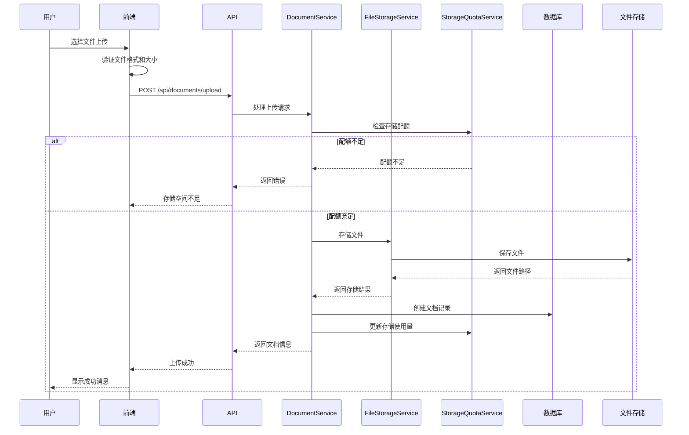
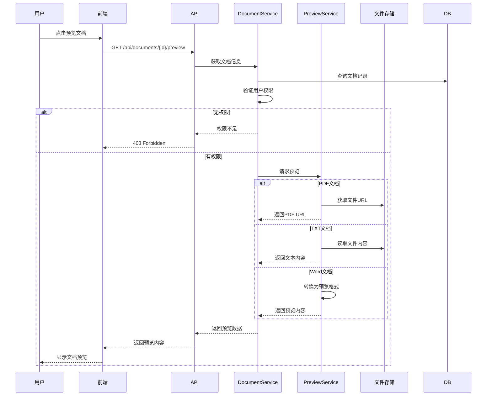

# 设计文档

## 概述

文档管理模块是智能文档助手系统的核心功能模块，负责文档的完整生命周期管理。该模块提供文档上传、存储、组织、检索、预览和删除等功能，支持PDF、Word、TXT三种文档格式，最大文件大小100MB。

系统采用前后端分离架构，后端使用Spring Boot提供RESTful API，前端使用Vue 3实现用户界面。文件存储支持MinIO对象存储或本地文件系统，文档元数据存储在PostgreSQL数据库中。所有文档操作都与用户认证系统集成，确保数据安全和用户隔离。

核心特性包括：
- 多格式文档支持（PDF、Word、TXT）
- 文件夹层级管理
- 批量上传和删除
- 在线文档预览
- 存储配额管理
- 细粒度权限控制

## 架构

### 整体架构

```
┌─────────────────────────────────────────┐
│         前端层 (Vue 3)                   │
│  - 文档列表页面                          │
│  - 文档上传组件                          │
│  - 文档预览组件                          │
│  - 文件夹管理组件                        │
└──────────────┬──────────────────────────┘
               │ HTTPS + JWT Token
┌──────────────▼──────────────────────────┐
│         API层 (Spring Boot)              │
│  - DocumentController                    │
│  - FolderController                      │
│  - 文件上传拦截器                        │
│  - 权限验证过滤器                        │
└──────────────┬──────────────────────────┘
               │
┌──────────────▼──────────────────────────┐
│         业务逻辑层 (Service)             │
│  - DocumentService                       │
│  - FolderService                         │
│  - FileStorageService                    │
│  - DocumentPreviewService                │
│  - StorageQuotaService                   │
└──────────────┬──────────────────────────┘
               │
┌──────────────▼──────────────────────────┐
│         数据访问层 (Repository)          │
│  - DocumentRepository                    │
│  - FolderRepository                      │
└──────────────┬──────────────────────────┘
               │
┌──────────────▼──────────────────────────┐
│         数据存储层                       │
│  - PostgreSQL (文档元数据)               │
│  - MinIO/本地存储 (文件内容)             │
│  - Redis (缓存)                          │
└─────────────────────────────────────────┘
```

### 文档上传流程



### 文档预览流程



## 组件和接口

### 后端组件

#### 1. DocumentController
文档管理API接口控制器

**接口列表：**
- `POST /api/documents/upload` - 上传单个文档
- `POST /api/documents/batch-upload` - 批量上传文档
- `GET /api/documents` - 获取文档列表（支持分页、搜索、筛选）
- `GET /api/documents/{id}` - 获取文档详情
- `GET /api/documents/{id}/preview` - 预览文档
- `GET /api/documents/{id}/download` - 下载文档
- `PUT /api/documents/{id}` - 更新文档信息（重命名、移动）
- `DELETE /api/documents/{id}` - 删除文档
- `DELETE /api/documents/batch` - 批量删除文档
- `GET /api/documents/storage-info` - 获取存储空间信息

#### 2. FolderController
文件夹管理API接口控制器

**接口列表：**
- `POST /api/folders` - 创建文件夹
- `GET /api/folders` - 获取文件夹列表
- `GET /api/folders/{id}` - 获取文件夹详情
- `PUT /api/folders/{id}` - 更新文件夹（重命名）
- `DELETE /api/folders/{id}` - 删除文件夹
- `GET /api/folders/{id}/documents` - 获取文件夹中的文档

#### 3. DocumentService
文档业务逻辑服务

**核心方法：**
```java
public interface DocumentService {
    DocumentDTO uploadDocument(Long userId, MultipartFile file, Long folderId);
    List<DocumentDTO> batchUploadDocuments(Long userId, List<MultipartFile> files, Long folderId);
    Page<DocumentDTO> getDocuments(Long userId, DocumentQueryRequest request);
    DocumentDTO getDocumentById(Long userId, Long documentId);
    PreviewResponse previewDocument(Long userId, Long documentId);
    byte[] downloadDocument(Long userId, Long documentId);
    DocumentDTO updateDocument(Long userId, Long documentId, UpdateDocumentRequest request);
    void deleteDocument(Long userId, Long documentId);
    BatchOperationResult batchDeleteDocuments(Long userId, List<Long> documentIds);
    StorageInfo getStorageInfo(Long userId);
}
```

#### 4. FolderService
文件夹业务逻辑服务

**核心方法：**
```java
public interface FolderService {
    FolderDTO createFolder(Long userId, CreateFolderRequest request);
    List<FolderDTO> getFolders(Long userId, Long parentId);
    FolderDTO getFolderById(Long userId, Long folderId);
    FolderDTO updateFolder(Long userId, Long folderId, UpdateFolderRequest request);
    void deleteFolder(Long userId, Long folderId);
    List<DocumentDTO> getDocumentsInFolder(Long userId, Long folderId);
}
```

#### 5. FileStorageService
文件存储服务

**核心方法：**
```java
public interface FileStorageService {
    String storeFile(MultipartFile file, Long userId);
    byte[] loadFile(String filePath);
    void deleteFile(String filePath);
    String generateUniqueFileName(String originalFilename, Long userId);
    boolean fileExists(String filePath);
}
```

#### 6. DocumentPreviewService
文档预览服务

**核心方法：**
```java
public interface DocumentPreviewService {
    PreviewResponse previewPdf(String filePath);
    PreviewResponse previewText(String filePath);
    PreviewResponse previewWord(String filePath);
}
```

#### 7. StorageQuotaService
存储配额管理服务

**核心方法：**
```java
public interface StorageQuotaService {
    boolean checkQuota(Long userId, long fileSize);
    void increaseUsage(Long userId, long fileSize);
    void decreaseUsage(Long userId, long fileSize);
    StorageInfo getStorageInfo(Long userId);
    void updateQuota(Long userId, long newQuota);
}
```

### 前端组件

#### 1. 文档管理页面
- `DocumentListPage.vue` - 文档列表主页面
- `DocumentUpload.vue` - 文档上传组件
- `DocumentPreview.vue` - 文档预览组件
- `DocumentCard.vue` - 文档卡片组件
- `FolderTree.vue` - 文件夹树形组件
- `StorageQuota.vue` - 存储空间显示组件

#### 2. API客户端
```typescript
// api/document.ts
export const documentApi = {
  uploadDocument: (file: File, folderId?: number) => 
    axios.post('/api/documents/upload', formData),
  batchUpload: (files: File[], folderId?: number) => 
    axios.post('/api/documents/batch-upload', formData),
  getDocuments: (params: DocumentQueryParams) => 
    axios.get('/api/documents', { params }),
  getDocument: (id: number) => 
    axios.get(`/api/documents/${id}`),
  previewDocument: (id: number) => 
    axios.get(`/api/documents/${id}/preview`),
  downloadDocument: (id: number) => 
    axios.get(`/api/documents/${id}/download`, { responseType: 'blob' }),
  updateDocument: (id: number, data: UpdateDocumentRequest) => 
    axios.put(`/api/documents/${id}`, data),
  deleteDocument: (id: number) => 
    axios.delete(`/api/documents/${id}`),
  batchDelete: (ids: number[]) => 
    axios.delete('/api/documents/batch', { data: { ids } }),
  getStorageInfo: () => 
    axios.get('/api/documents/storage-info')
};
```

## 数据模型

### 数据库表结构

#### documents表
```sql
CREATE TABLE documents (
    id BIGSERIAL PRIMARY KEY,
    user_id BIGINT NOT NULL REFERENCES users(id) ON DELETE CASCADE,
    folder_id BIGINT REFERENCES folders(id) ON DELETE SET NULL,
    filename VARCHAR(255) NOT NULL,
    original_filename VARCHAR(255) NOT NULL,
    file_path VARCHAR(500) NOT NULL,
    file_type VARCHAR(50) NOT NULL,
    file_size BIGINT NOT NULL,
    mime_type VARCHAR(100),
    created_at TIMESTAMP DEFAULT CURRENT_TIMESTAMP,
    updated_at TIMESTAMP DEFAULT CURRENT_TIMESTAMP
);

CREATE INDEX idx_documents_user_id ON documents(user_id);
CREATE INDEX idx_documents_folder_id ON documents(folder_id);
CREATE INDEX idx_documents_filename ON documents(filename);
CREATE INDEX idx_documents_file_type ON documents(file_type);
CREATE INDEX idx_documents_created_at ON documents(created_at);
```

#### folders表
```sql
CREATE TABLE folders (
    id BIGSERIAL PRIMARY KEY,
    user_id BIGINT NOT NULL REFERENCES users(id) ON DELETE CASCADE,
    parent_id BIGINT REFERENCES folders(id) ON DELETE CASCADE,
    name VARCHAR(255) NOT NULL,
    path VARCHAR(1000),
    created_at TIMESTAMP DEFAULT CURRENT_TIMESTAMP,
    updated_at TIMESTAMP DEFAULT CURRENT_TIMESTAMP,
    UNIQUE(user_id, parent_id, name)
);

CREATE INDEX idx_folders_user_id ON folders(user_id);
CREATE INDEX idx_folders_parent_id ON folders(parent_id);
CREATE INDEX idx_folders_path ON folders(path);
```

### Java实体类

#### Document实体
```java
@Entity
@Table(name = "documents")
public class Document {
    @Id
    @GeneratedValue(strategy = GenerationType.IDENTITY)
    private Long id;
    
    @Column(name = "user_id", nullable = false)
    private Long userId;
    
    @Column(name = "folder_id")
    private Long folderId;
    
    @Column(nullable = false)
    private String filename;
    
    @Column(name = "original_filename", nullable = false)
    private String originalFilename;
    
    @Column(name = "file_path", nullable = false)
    private String filePath;
    
    @Column(name = "file_type", nullable = false)
    private String fileType;
    
    @Column(name = "file_size", nullable = false)
    private Long fileSize;
    
    @Column(name = "mime_type")
    private String mimeType;
    
    @Column(name = "created_at")
    private LocalDateTime createdAt;
    
    @Column(name = "updated_at")
    private LocalDateTime updatedAt;
}
```

#### Folder实体
```java
@Entity
@Table(name = "folders")
public class Folder {
    @Id
    @GeneratedValue(strategy = GenerationType.IDENTITY)
    private Long id;
    
    @Column(name = "user_id", nullable = false)
    private Long userId;
    
    @Column(name = "parent_id")
    private Long parentId;
    
    @Column(nullable = false)
    private String name;
    
    @Column(length = 1000)
    private String path;
    
    @Column(name = "created_at")
    private LocalDateTime createdAt;
    
    @Column(name = "updated_at")
    private LocalDateTime updatedAt;
}
```

### DTO对象

#### 请求DTO
```java
public class DocumentQueryRequest {
    private Integer page = 0;
    private Integer size = 20;
    private String keyword;
    private String fileType;
    private Long folderId;
    private String sortBy = "createdAt";
    private String sortDirection = "DESC";
}

public class UpdateDocumentRequest {
    private String filename;
    private Long folderId;
}

public class CreateFolderRequest {
    @NotBlank
    private String name;
    private Long parentId;
}
```

#### 响应DTO
```java
public class DocumentDTO {
    private Long id;
    private String filename;
    private String originalFilename;
    private String fileType;
    private Long fileSize;
    private String mimeType;
    private Long folderId;
    private String folderName;
    private LocalDateTime createdAt;
    private LocalDateTime updatedAt;
}

public class StorageInfo {
    private Long usedSpace;
    private Long totalQuota;
    private Long remainingSpace;
    private Double usagePercentage;
    private Boolean nearLimit;
}

public class BatchOperationResult {
    private Integer successCount;
    private Integer failureCount;
    private List<Long> successIds;
    private List<OperationError> errors;
}
```

## 正确性属性

*属性是指在系统所有有效执行过程中都应该成立的特征或行为——本质上是关于系统应该做什么的形式化陈述。属性是人类可读规范和机器可验证正确性保证之间的桥梁。*


### 属性 1: 有效格式文件上传成功
*对于任何*PDF、Word或TXT格式的文件（大小不超过100MB），上传应该成功并在数据库和文件系统中创建相应记录
**验证需求：1.1, 1.4**

### 属性 2: 无效格式文件被拒绝
*对于任何*非PDF、Word、TXT格式的文件，上传应该被拒绝并返回明确的错误信息
**验证需求：1.3**

### 属性 3: 配额限制正确执行
*对于任何*用户，当存储空间使用量超过配额时，新的文件上传应该被拒绝
**验证需求：1.5**

### 属性 4: 文档列表排序正确性
*对于任何*用户的文档列表，返回的文档应该按上传时间倒序排列
**验证需求：2.1**

### 属性 5: 分页功能正确性
*对于任何*分页请求，返回的文档数量应该等于请求的每页数量（最后一页除外）
**验证需求：2.2**

### 属性 6: 搜索功能正确性
*对于任何*搜索关键词，返回的所有文档文件名都应该包含该关键词
**验证需求：2.3**

### 属性 7: 文件类型筛选正确性
*对于任何*文件类型筛选，返回的所有文档都应该是指定的文件类型
**验证需求：2.4**

### 属性 8: 文件夹筛选正确性
*对于任何*文件夹筛选，返回的所有文档都应该属于指定的文件夹
**验证需求：2.5**

### 属性 9: 文档预览权限验证
*对于任何*文档预览请求，只有文档所有者或管理员才能成功预览
**验证需求：3.4**

### 属性 10: 重命名保持内容不变
*对于任何*文档重命名操作，文件内容和大小应该保持不变
**验证需求：4.1**

### 属性 11: 移动操作更新关联
*对于任何*文档移动操作，文档的文件夹关联应该正确更新
**验证需求：4.2**

### 属性 12: 删除操作完整性
*对于任何*文档删除操作，数据库记录和文件系统中的文件都应该被删除
**验证需求：4.4**

### 属性 13: 删除更新存储空间
*对于任何*文档删除操作，用户的存储空间使用量应该相应减少
**验证需求：4.5**

### 属性 14: 文件夹层级结构正确性
*对于任何*子文件夹创建操作，应该正确建立父子关系并支持多层级
**验证需求：5.2**

### 属性 15: 文件夹重命名不影响文档
*对于任何*文件夹重命名操作，文件夹中的文档应该保持不变
**验证需求：5.3**

### 属性 16: 非空文件夹删除被拒绝
*对于任何*包含文档的文件夹，删除操作应该被拒绝
**验证需求：5.5**

### 属性 17: 批量上传结果完整性
*对于任何*批量上传操作，返回的结果应该包含每个文件的处理状态
**验证需求：6.4**

### 属性 18: 批量上传错误隔离
*对于任何*批量上传操作，某个文件失败不应该影响其他文件的处理
**验证需求：6.2**

### 属性 19: 批量删除结果完整性
*对于任何*批量删除操作，返回的结果应该包含每个文档的删除状态
**验证需求：7.4**

### 属性 20: 批量删除权限验证
*对于任何*批量删除操作，无权限的文档应该被跳过并在结果中标记
**验证需求：7.3**

### 属性 21: 存储空间计算准确性
*对于任何*用户，存储空间使用量应该等于该用户所有文档大小的总和
**验证需求：8.1, 8.2**

### 属性 22: 存储空间信息完整性
*对于任何*存储空间查询，应该返回已使用空间、总配额和剩余空间
**验证需求：8.3**

### 属性 23: 文档访问权限验证
*对于任何*文档访问操作，只有文档所有者或管理员才能成功访问
**验证需求：9.1, 9.2**

### 属性 24: 管理员访问权限
*对于任何*管理员的文档访问请求，应该允许访问并记录操作日志
**验证需求：9.3**

### 属性 25: 操作日志记录完整性
*对于任何*敏感操作（删除、移动），应该记录包含操作前后状态的日志
**验证需求：9.5**

### 属性 26: 文件名唯一性
*对于任何*文件存储操作，生成的文件名应该是唯一的，避免冲突
**验证需求：10.1**

### 属性 27: 目录结构组织正确性
*对于任何*文件存储操作，文件应该按用户ID和日期组织在目录结构中
**验证需求：10.2**

## 错误处理

### 错误响应格式

所有API错误响应遵循统一格式：

```json
{
  "timestamp": "2025-12-16T10:30:00Z",
  "status": 400,
  "error": "Bad Request",
  "message": "文件格式不支持",
  "path": "/api/documents/upload",
  "errorCode": "UNSUPPORTED_FILE_FORMAT"
}
```

### 错误代码定义

#### 文档操作相关错误
- `UNSUPPORTED_FILE_FORMAT` - 不支持的文件格式
- `FILE_SIZE_EXCEEDED` - 文件大小超限
- `STORAGE_QUOTA_EXCEEDED` - 存储空间不足
- `DOCUMENT_NOT_FOUND` - 文档不存在
- `FOLDER_NOT_FOUND` - 文件夹不存在
- `FOLDER_NOT_EMPTY` - 文件夹不为空
- `DUPLICATE_FOLDER_NAME` - 文件夹名称重复
- `FILE_UPLOAD_FAILED` - 文件上传失败
- `FILE_DOWNLOAD_FAILED` - 文件下载失败
- `FILE_PREVIEW_FAILED` - 文件预览失败

#### 权限相关错误
- `DOCUMENT_ACCESS_DENIED` - 无权访问文档
- `FOLDER_ACCESS_DENIED` - 无权访问文件夹

#### 系统错误
- `STORAGE_SERVICE_ERROR` - 存储服务错误
- `FILE_CONVERSION_ERROR` - 文件转换错误

### 异常处理策略

#### 1. 文件上传异常处理
```java
@ExceptionHandler(MaxUploadSizeExceededException.class)
public ResponseEntity<ErrorResponse> handleMaxSizeException(
        MaxUploadSizeExceededException ex, HttpServletRequest request) {
    ErrorResponse error = ErrorResponse.builder()
        .timestamp(LocalDateTime.now())
        .status(HttpStatus.PAYLOAD_TOO_LARGE.value())
        .error("Payload Too Large")
        .message("文件大小超过限制（最大100MB）")
        .path(request.getRequestURI())
        .errorCode("FILE_SIZE_EXCEEDED")
        .build();
    return ResponseEntity.status(HttpStatus.PAYLOAD_TOO_LARGE).body(error);
}
```

#### 2. 文档不存在异常处理
```java
@ExceptionHandler(DocumentNotFoundException.class)
public ResponseEntity<ErrorResponse> handleDocumentNotFound(
        DocumentNotFoundException ex, HttpServletRequest request) {
    ErrorResponse error = ErrorResponse.builder()
        .timestamp(LocalDateTime.now())
        .status(HttpStatus.NOT_FOUND.value())
        .error("Not Found")
        .message(ex.getMessage())
        .path(request.getRequestURI())
        .errorCode("DOCUMENT_NOT_FOUND")
        .build();
    return ResponseEntity.status(HttpStatus.NOT_FOUND).body(error);
}
```

#### 3. 存储配额异常处理
```java
@ExceptionHandler(StorageQuotaExceededException.class)
public ResponseEntity<ErrorResponse> handleStorageQuotaExceeded(
        StorageQuotaExceededException ex, HttpServletRequest request) {
    ErrorResponse error = ErrorResponse.builder()
        .timestamp(LocalDateTime.now())
        .status(HttpStatus.INSUFFICIENT_STORAGE.value())
        .error("Insufficient Storage")
        .message(ex.getMessage())
        .path(request.getRequestURI())
        .errorCode("STORAGE_QUOTA_EXCEEDED")
        .build();
    return ResponseEntity.status(HttpStatus.INSUFFICIENT_STORAGE).body(error);
}
```

## 测试策略

### 单元测试

#### 后端单元测试
- **Service层测试**
  - DocumentService的上传、下载、删除逻辑
  - FolderService的创建、删除、层级管理逻辑
  - FileStorageService的文件存储和检索逻辑
  - StorageQuotaService的配额计算和验证逻辑

- **Repository层测试**
  - 使用H2内存数据库测试
  - 测试自定义查询方法
  - 测试级联删除和外键约束

#### 前端单元测试
- **组件测试**
  - 文件上传组件的验证逻辑
  - 文档列表的筛选和排序
  - 文件夹树的展开和选择

### 属性基础测试（Property-Based Testing）

#### 测试框架
- **后端**：jqwik
- **前端**：fast-check

#### 测试配置
- 每个属性测试至少运行100次迭代
- 使用随机数据生成器创建测试输入

#### 属性测试示例

**属性 1测试：有效格式文件上传成功**
```java
@Property
// Feature: document-management, Property 1: 有效格式文件上传成功
void validFileFormatUploadSucceeds(
    @ForAll("validDocumentFile") MockMultipartFile file,
    @ForAll @LongRange(min = 1, max = 1000) Long userId) {
    
    // 确保文件大小不超过100MB
    Assume.that(file.getSize() <= 100 * 1024 * 1024);
    
    DocumentDTO result = documentService.uploadDocument(userId, file, null);
    
    assertThat(result.getId()).isNotNull();
    assertThat(documentRepository.findById(result.getId())).isPresent();
    
    // 验证文件在文件系统中存在
    assertThat(fileStorageService.fileExists(result.getFilePath())).isTrue();
}

@Provide
Arbitrary<MockMultipartFile> validDocumentFile() {
    return Arbitraries.of("pdf", "docx", "txt")
        .map(ext -> new MockMultipartFile(
            "file",
            "test." + ext,
            "application/" + ext,
            "test content".getBytes()
        ));
}
```

**属性 12测试：删除操作完整性**
```java
@Property
// Feature: document-management, Property 12: 删除操作完整性
void deleteRemovesBothDatabaseAndFile(
    @ForAll @LongRange(min = 1, max = 1000) Long userId) {
    
    // 创建测试文档
    Document document = createTestDocument(userId);
    String filePath = document.getFilePath();
    Long documentId = document.getId();
    
    // 验证文档存在
    assertThat(documentRepository.findById(documentId)).isPresent();
    assertThat(fileStorageService.fileExists(filePath)).isTrue();
    
    // 删除文档
    documentService.deleteDocument(userId, documentId);
    
    // 验证数据库记录已删除
    assertThat(documentRepository.findById(documentId)).isEmpty();
    
    // 验证文件已删除
    assertThat(fileStorageService.fileExists(filePath)).isFalse();
}
```

**属性 21测试：存储空间计算准确性**
```java
@Property
// Feature: document-management, Property 21: 存储空间计算准确性
void storageUsageEqualsSum OfDocumentSizes(
    @ForAll @LongRange(min = 1, max = 1000) Long userId,
    @ForAll @IntRange(min = 1, max = 10) int documentCount) {
    
    // 创建多个文档
    List<Document> documents = new ArrayList<>();
    long expectedTotalSize = 0;
    
    for (int i = 0; i < documentCount; i++) {
        Document doc = createTestDocument(userId);
        documents.add(doc);
        expectedTotalSize += doc.getFileSize();
    }
    
    // 获取存储空间信息
    StorageInfo storageInfo = storageQuotaService.getStorageInfo(userId);
    
    // 验证使用量等于所有文档大小之和
    assertThat(storageInfo.getUsedSpace()).isEqualTo(expectedTotalSize);
}
```

### 集成测试

#### API集成测试
- 使用Spring Boot Test和TestRestTemplate
- 测试完整的文档上传-下载-删除流程
- 测试批量操作
- 测试权限控制

#### 测试场景
- 完整的文档管理流程
- 文件夹层级管理
- 存储配额限制
- 并发上传测试

### 性能测试

#### 测试指标
- 文件上传速度（目标：10MB/s以上）
- 文档列表查询响应时间（目标：<200ms）
- 批量操作处理时间
- 并发用户支持数（目标：50+）

#### 测试工具
- JMeter进行压力测试
- 监控数据库查询性能
- 监控文件系统I/O

### 测试覆盖率目标
- 代码覆盖率：至少80%
- 分支覆盖率：至少75%
- 所有正确性属性必须有对应的属性测试
- 关键业务流程必须有集成测试覆盖
