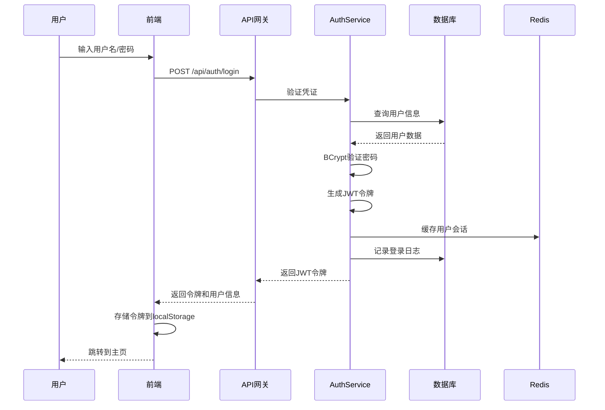
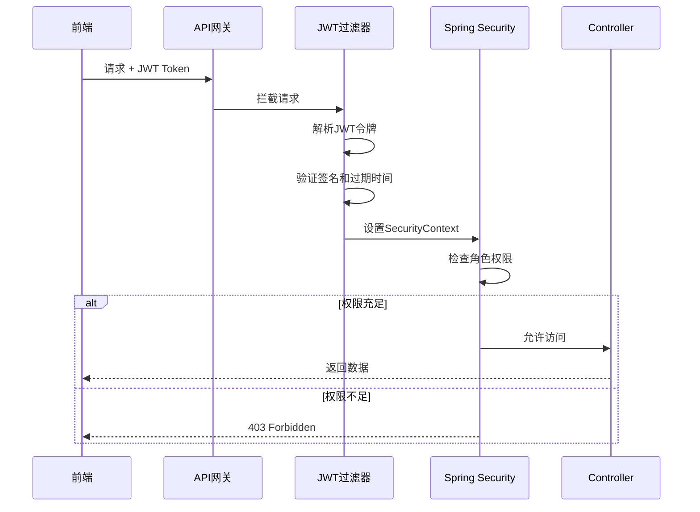

# 设计文档

## 概述

用户认证系统是智能文档助手的核心安全模块，负责用户身份验证、授权和会话管理。系统采用前后端分离架构，后端使用Spring Boot 3.x + Spring Security 6.x构建RESTful API，前端使用Vue 3 + Composition API实现用户界面。认证机制基于JWT令牌，密码使用BCrypt算法加密存储，确保用户数据安全。

系统支持两种注册方式（邮箱/用户名），提供完整的密码重置流程，并实现基于角色的访问控制（RBAC）。所有敏感操作都会记录详细的审计日志，便于安全监控和问题追溯。

## 架构

### 整体架构

系统采用三层架构设计：

```
┌─────────────────────────────────────────┐
│         前端层 (Vue 3)                   │
│  - 登录/注册页面                         │
│  - 个人中心页面                          │
│  - 路由守卫 (JWT验证)                    │
└──────────────┬──────────────────────────┘
               │ HTTPS + JWT Token
┌──────────────▼──────────────────────────┐
│         API层 (Spring Boot)              │
│  - AuthController (认证接口)             │
│  - UserController (用户管理接口)         │
│  - JWT过滤器                             │
│  - 全局异常处理                          │
└──────────────┬──────────────────────────┘
               │
┌──────────────▼──────────────────────────┐
│         业务逻辑层 (Service)             │
│  - AuthService (认证业务)                │
│  - UserService (用户管理业务)            │
│  - EmailService (邮件服务)               │
│  - TokenService (令牌管理)               │
└──────────────┬──────────────────────────┘
               │
┌──────────────▼──────────────────────────┐
│         数据访问层 (Repository)          │
│  - UserRepository                        │
│  - SystemLogRepository                   │
│  - PasswordResetTokenRepository          │
└──────────────┬──────────────────────────┘
               │
┌──────────────▼──────────────────────────┐
│         数据存储层                       │
│  - PostgreSQL (用户数据)                 │
│  - Redis (会话缓存、验证码)              │
│  - MinIO/本地存储 (头像文件)             │
└─────────────────────────────────────────┘
```

### 认证流程



### 权限控制流程



## 组件和接口

### 后端组件

#### 1. AuthController
认证相关的API接口控制器

**接口列表：**
- `POST /api/auth/register` - 用户注册
- `POST /api/auth/verify-email` - 验证邮箱
- `POST /api/auth/login` - 用户登录
- `POST /api/auth/logout` - 用户登出
- `POST /api/auth/refresh-token` - 刷新令牌
- `POST /api/auth/forgot-password` - 请求密码重置
- `POST /api/auth/reset-password` - 重置密码

#### 2. UserController
用户信息管理接口控制器

**接口列表：**
- `GET /api/users/me` - 获取当前用户信息
- `PUT /api/users/me` - 更新个人信息
- `POST /api/users/me/avatar` - 上传头像
- `PUT /api/users/me/email` - 修改邮箱
- `PUT /api/users/me/password` - 修改密码
- `GET /api/users/{id}` - 获取指定用户信息（管理员）
- `PUT /api/users/{id}/role` - 修改用户角色（管理员）

#### 3. SystemLogController
系统日志查询接口（管理员专用）

**接口列表：**
- `GET /api/logs/login` - 查询登录日志
- `GET /api/logs/login/user/{userId}` - 查询指定用户登录日志

#### 4. AuthService
认证业务逻辑服务

**核心方法：**
```java
public interface AuthService {
    RegisterResponse register(RegisterRequest request);
    void verifyEmail(String email, String code);
    LoginResponse login(LoginRequest request);
    void logout(String token);
    TokenResponse refreshToken(String refreshToken);
    void requestPasswordReset(String email);
    void resetPassword(String token, String newPassword);
}
```

#### 5. UserService
用户管理业务逻辑服务

**核心方法：**
```java
public interface UserService {
    UserDTO getCurrentUser(Long userId);
    UserDTO updateUserInfo(Long userId, UpdateUserRequest request);
    String uploadAvatar(Long userId, MultipartFile file);
    void updateEmail(Long userId, String newEmail, String verificationCode);
    void updatePassword(Long userId, String oldPassword, String newPassword);
    void updateUserRole(Long adminId, Long userId, UserRole newRole);
}
```

#### 6. TokenService
JWT令牌管理服务

**核心方法：**
```java
public interface TokenService {
    String generateAccessToken(User user, boolean rememberMe);
    String generateRefreshToken(User user);
    Claims validateToken(String token);
    void invalidateToken(String token);
    boolean isTokenBlacklisted(String token);
}
```

#### 7. EmailService
邮件发送服务

**核心方法：**
```java
public interface EmailService {
    void sendVerificationCode(String email, String code);
    void sendPasswordResetLink(String email, String resetToken);
    void sendPasswordChangedNotification(String email);
}
```

### 前端组件

#### 1. 认证相关组件
- `LoginPage.vue` - 登录页面
- `RegisterPage.vue` - 注册页面
- `ForgotPasswordPage.vue` - 忘记密码页面
- `ResetPasswordPage.vue` - 重置密码页面
- `EmailVerificationPage.vue` - 邮箱验证页面

#### 2. 用户管理组件
- `ProfilePage.vue` - 个人中心页面
- `AvatarUpload.vue` - 头像上传组件
- `PasswordChangeForm.vue` - 密码修改表单
- `EmailChangeForm.vue` - 邮箱修改表单

#### 3. 路由守卫
```typescript
// router/guards.ts
export const authGuard = (to: RouteLocationNormalized) => {
  const token = localStorage.getItem('access_token');
  if (!token && to.meta.requiresAuth) {
    return { name: 'Login' };
  }
  
  const userRole = getUserRoleFromToken(token);
  if (to.meta.requiresAdmin && userRole !== 'ADMIN') {
    return { name: 'Forbidden' };
  }
};
```

#### 4. API客户端
```typescript
// api/auth.ts
export const authApi = {
  register: (data: RegisterRequest) => axios.post('/api/auth/register', data),
  login: (data: LoginRequest) => axios.post('/api/auth/login', data),
  logout: () => axios.post('/api/auth/logout'),
  refreshToken: () => axios.post('/api/auth/refresh-token'),
  forgotPassword: (email: string) => axios.post('/api/auth/forgot-password', { email }),
  resetPassword: (token: string, password: string) => 
    axios.post('/api/auth/reset-password', { token, password })
};
```

## 数据模型

### 数据库表结构

#### users表
```sql
CREATE TABLE users (
    id BIGSERIAL PRIMARY KEY,
    username VARCHAR(50) UNIQUE NOT NULL,
    email VARCHAR(100) UNIQUE NOT NULL,
    password_hash VARCHAR(255) NOT NULL,
    role VARCHAR(20) NOT NULL DEFAULT 'REGULAR_USER',
    avatar_url VARCHAR(500),
    is_email_verified BOOLEAN DEFAULT FALSE,
    created_at TIMESTAMP DEFAULT CURRENT_TIMESTAMP,
    updated_at TIMESTAMP DEFAULT CURRENT_TIMESTAMP,
    last_login_at TIMESTAMP
);

CREATE INDEX idx_users_email ON users(email);
CREATE INDEX idx_users_username ON users(username);
CREATE INDEX idx_users_role ON users(role);
```

#### system_logs表
```sql
CREATE TABLE system_logs (
    id BIGSERIAL PRIMARY KEY,
    user_id BIGINT REFERENCES users(id),
    operation_type VARCHAR(50) NOT NULL,
    ip_address VARCHAR(45),
    user_agent VARCHAR(500),
    status VARCHAR(20) NOT NULL,
    error_message TEXT,
    created_at TIMESTAMP DEFAULT CURRENT_TIMESTAMP
);

CREATE INDEX idx_logs_user_id ON system_logs(user_id);
CREATE INDEX idx_logs_operation_type ON system_logs(operation_type);
CREATE INDEX idx_logs_created_at ON system_logs(created_at);
```

#### password_reset_tokens表
```sql
CREATE TABLE password_reset_tokens (
    id BIGSERIAL PRIMARY KEY,
    user_id BIGINT NOT NULL REFERENCES users(id),
    token VARCHAR(255) UNIQUE NOT NULL,
    expires_at TIMESTAMP NOT NULL,
    used BOOLEAN DEFAULT FALSE,
    created_at TIMESTAMP DEFAULT CURRENT_TIMESTAMP
);

CREATE INDEX idx_reset_tokens_token ON password_reset_tokens(token);
CREATE INDEX idx_reset_tokens_user_id ON password_reset_tokens(user_id);
```

### Java实体类

#### User实体
```java
@Entity
@Table(name = "users")
public class User {
    @Id
    @GeneratedValue(strategy = GenerationType.IDENTITY)
    private Long id;
    
    @Column(unique = true, nullable = false, length = 50)
    private String username;
    
    @Column(unique = true, nullable = false, length = 100)
    private String email;
    
    @Column(name = "password_hash", nullable = false)
    private String passwordHash;
    
    @Enumerated(EnumType.STRING)
    @Column(nullable = false)
    private UserRole role = UserRole.REGULAR_USER;
    
    @Column(name = "avatar_url")
    private String avatarUrl;
    
    @Column(name = "is_email_verified")
    private Boolean isEmailVerified = false;
    
    @Column(name = "created_at")
    private LocalDateTime createdAt;
    
    @Column(name = "updated_at")
    private LocalDateTime updatedAt;
    
    @Column(name = "last_login_at")
    private LocalDateTime lastLoginAt;
}

public enum UserRole {
    REGULAR_USER,
    ADMINISTRATOR
}
```

#### SystemLog实体
```java
@Entity
@Table(name = "system_logs")
public class SystemLog {
    @Id
    @GeneratedValue(strategy = GenerationType.IDENTITY)
    private Long id;
    
    @Column(name = "user_id")
    private Long userId;
    
    @Column(name = "operation_type", nullable = false)
    private String operationType;
    
    @Column(name = "ip_address")
    private String ipAddress;
    
    @Column(name = "user_agent")
    private String userAgent;
    
    @Column(nullable = false)
    private String status;
    
    @Column(name = "error_message")
    private String errorMessage;
    
    @Column(name = "created_at")
    private LocalDateTime createdAt;
}
```

### DTO对象

#### 请求DTO
```java
public class RegisterRequest {
    @NotBlank
    @Size(min = 3, max = 50)
    private String username;
    
    @NotBlank
    @Email
    private String email;
    
    @NotBlank
    @Size(min = 8, max = 100)
    private String password;
}

public class LoginRequest {
    @NotBlank
    private String usernameOrEmail;
    
    @NotBlank
    private String password;
    
    private Boolean rememberMe = false;
}
```

#### 响应DTO
```java
public class LoginResponse {
    private String accessToken;
    private String refreshToken;
    private UserDTO user;
    private Long expiresIn;
}

public class UserDTO {
    private Long id;
    private String username;
    private String email;
    private String role;
    private String avatarUrl;
    private Boolean isEmailVerified;
    private LocalDateTime createdAt;
}
```

### Redis数据结构

#### 验证码存储
```
Key: verification_code:{email}
Value: {code}
TTL: 600秒 (10分钟)
```

#### 令牌黑名单
```
Key: token_blacklist:{jti}
Value: "1"
TTL: 令牌剩余有效时间
```

#### 用户会话缓存
```
Key: user_session:{userId}
Value: {JSON序列化的用户信息}
TTL: 3600秒 (1小时)
```

## 正确性属性

*属性是指在系统所有有效执行过程中都应该成立的特征或行为——本质上是关于系统应该做什么的形式化陈述。属性是人类可读规范和机器可验证正确性保证之间的桥梁。*

### 属性 1: 注册成功创建用户
*对于任何*有效的注册请求（包含有效邮箱/用户名和符合要求的密码），系统应该成功创建用户账户并发送验证码
**验证需求：1.1, 1.2**

### 属性 2: 邮箱和用户名唯一性
*对于任何*已存在的邮箱或用户名，尝试使用相同邮箱或用户名注册应该被拒绝并返回明确错误信息
**验证需求：1.3, 1.4**

### 属性 3: 验证码验证正确性
*对于任何*生成的验证码，使用正确的验证码应该激活账户，使用错误的验证码应该被拒绝
**验证需求：1.5**

### 属性 4: 有效凭证登录成功
*对于任何*已注册用户，使用正确的用户名/邮箱和密码登录应该返回有效的JWT令牌
**验证需求：2.1**

### 属性 5: 错误密码登录失败
*对于任何*已注册用户，使用错误的密码登录应该被拒绝并返回身份验证失败错误
**验证需求：2.2**

### 属性 6: 令牌过期时间正确性
*对于任何*登录请求，选择"记住登录"应生成30天有效期令牌，否则生成24小时有效期令牌
**验证需求：2.3, 2.4**

### 属性 7: 登录日志完整性
*对于任何*登录尝试（成功或失败），系统应该在system_logs表中创建包含完整信息的日志记录
**验证需求：2.5, 6.1, 6.2**

### 属性 8: 头像文件格式验证
*对于任何*上传的头像文件，只有JPG、PNG或GIF格式应该被接受，其他格式应该被拒绝
**验证需求：3.1**

### 属性 9: 个人信息更新一致性
*对于任何*有效的个人信息更新请求，数据库中的用户记录应该被正确更新并反映新值
**验证需求：3.3**

### 属性 10: 邮箱修改需要验证
*对于任何*邮箱修改请求，只有在新邮箱验证成功后才应该更新邮箱地址
**验证需求：3.4**

### 属性 11: 密码字段不可见性
*对于任何*返回用户信息的API响应，响应数据中不应该包含密码或密码哈希字段
**验证需求：3.5, 7.5**

### 属性 12: 默认角色分配
*对于任何*新创建的用户账户，应该默认分配普通用户角色
**验证需求：4.1**

### 属性 13: 角色修改立即生效
*对于任何*管理员执行的角色修改操作，用户的角色应该立即更新并在下次权限检查时生效
**验证需求：4.2**

### 属性 14: 权限控制正确性
*对于任何*受保护的管理员功能，普通用户访问应该被拒绝，管理员访问应该被允许
**验证需求：4.3, 4.4**

### 属性 15: JWT令牌权限验证
*对于任何*包含JWT令牌的API请求，系统应该验证令牌中的角色信息并执行相应的权限检查
**验证需求：4.5**

### 属性 16: 密码重置流程完整性
*对于任何*密码重置请求，系统应该生成重置令牌、发送邮件，并在验证成功后更新密码
**验证需求：5.1, 5.2, 5.4**

### 属性 17: 密码重置令牌失效
*对于任何*密码重置成功的用户，该用户的所有现有JWT令牌应该立即失效
**验证需求：5.5**

### 属性 18: 日志查询排序和筛选
*对于任何*日志查询请求，返回的结果应该按时间倒序排列，并正确应用用户ID和时间范围筛选条件
**验证需求：6.3, 6.4, 6.5**

### 属性 19: BCrypt密码加密
*对于任何*存储的密码，数据库中应该存储BCrypt加密后的哈希值，而不是明文密码
**验证需求：7.1**

### 属性 20: BCrypt密码验证
*对于任何*密码验证请求，系统应该使用BCrypt算法比对输入密码和存储的哈希值
**验证需求：7.2**

### 属性 21: 密码复杂度验证
*对于任何*密码输入，长度少于8个字符或不包含字母和数字的密码应该被拒绝
**验证需求：7.3, 7.4**

### 属性 22: JWT令牌结构完整性
*对于任何*生成的JWT令牌，应该包含用户ID、用户名、角色和过期时间信息
**验证需求：8.1**

### 属性 23: JWT令牌验证正确性
*对于任何*JWT令牌验证请求，系统应该检查签名有效性和过期时间，拒绝无效或过期的令牌
**验证需求：8.2, 8.3, 8.4**

### 属性 24: 令牌刷新往返一致性
*对于任何*有效的刷新令牌请求，系统应该验证当前令牌并生成新的有效JWT令牌
**验证需求：8.5**


## 错误处理

### 错误响应格式

所有API错误响应遵循统一格式：

```json
{
  "timestamp": "2025-12-15T10:30:00Z",
  "status": 400,
  "error": "Bad Request",
  "message": "用户名已被使用",
  "path": "/api/auth/register",
  "errorCode": "USERNAME_ALREADY_EXISTS"
}
```

### 错误代码定义

#### 认证相关错误
- `INVALID_CREDENTIALS` - 用户名或密码错误
- `EMAIL_ALREADY_EXISTS` - 邮箱已被注册
- `USERNAME_ALREADY_EXISTS` - 用户名已被使用
- `INVALID_VERIFICATION_CODE` - 验证码错误或已过期
- `EMAIL_NOT_VERIFIED` - 邮箱未验证
- `TOKEN_EXPIRED` - JWT令牌已过期
- `TOKEN_INVALID` - JWT令牌无效
- `TOKEN_BLACKLISTED` - JWT令牌已被列入黑名单

#### 用户管理相关错误
- `USER_NOT_FOUND` - 用户不存在
- `INVALID_PASSWORD` - 密码格式不符合要求
- `PASSWORD_TOO_WEAK` - 密码强度不足
- `OLD_PASSWORD_INCORRECT` - 原密码错误
- `INVALID_FILE_FORMAT` - 文件格式不支持
- `FILE_SIZE_EXCEEDED` - 文件大小超限
- `EMAIL_VERIFICATION_REQUIRED` - 需要邮箱验证

#### 权限相关错误
- `ACCESS_DENIED` - 访问被拒绝
- `INSUFFICIENT_PERMISSIONS` - 权限不足
- `ADMIN_REQUIRED` - 需要管理员权限

#### 系统错误
- `INTERNAL_SERVER_ERROR` - 服务器内部错误
- `SERVICE_UNAVAILABLE` - 服务暂时不可用
- `EMAIL_SEND_FAILED` - 邮件发送失败

### 异常处理策略

#### 1. 全局异常处理器
```java
@RestControllerAdvice
public class GlobalExceptionHandler {
    
    @ExceptionHandler(AuthenticationException.class)
    public ResponseEntity<ErrorResponse> handleAuthenticationException(
            AuthenticationException ex, HttpServletRequest request) {
        ErrorResponse error = ErrorResponse.builder()
            .timestamp(LocalDateTime.now())
            .status(HttpStatus.UNAUTHORIZED.value())
            .error("Unauthorized")
            .message(ex.getMessage())
            .path(request.getRequestURI())
            .errorCode(ex.getErrorCode())
            .build();
        return ResponseEntity.status(HttpStatus.UNAUTHORIZED).body(error);
    }
    
    @ExceptionHandler(ValidationException.class)
    public ResponseEntity<ErrorResponse> handleValidationException(
            ValidationException ex, HttpServletRequest request) {
        // 处理验证异常
    }
    
    @ExceptionHandler(Exception.class)
    public ResponseEntity<ErrorResponse> handleGenericException(
            Exception ex, HttpServletRequest request) {
        // 记录错误日志
        log.error("Unexpected error occurred", ex);
        // 返回通用错误响应
    }
}
```

#### 2. 业务异常类层次结构
```java
public class BusinessException extends RuntimeException {
    private final String errorCode;
    private final HttpStatus httpStatus;
}

public class AuthenticationException extends BusinessException {
    // 认证相关异常
}

public class AuthorizationException extends BusinessException {
    // 授权相关异常
}

public class ValidationException extends BusinessException {
    // 验证相关异常
}
```

#### 3. 日志记录策略
- 所有异常都应该被记录到日志系统
- 敏感信息（如密码）不应该出现在日志中
- 错误日志应包含请求ID、用户ID、时间戳、错误堆栈等信息
- 使用不同的日志级别：ERROR（系统错误）、WARN（业务异常）、INFO（正常操作）

### 前端错误处理

#### 1. Axios拦截器
```typescript
axios.interceptors.response.use(
  response => response,
  error => {
    if (error.response?.status === 401) {
      // 令牌过期，跳转到登录页
      router.push('/login');
    } else if (error.response?.status === 403) {
      // 权限不足
      showErrorMessage('您没有权限执行此操作');
    } else {
      // 其他错误
      showErrorMessage(error.response?.data?.message || '操作失败');
    }
    return Promise.reject(error);
  }
);
```

#### 2. 错误提示组件
使用Element Plus的Message组件显示错误信息，提供友好的用户反馈。

## 测试策略

### 单元测试

单元测试用于验证各个组件的独立功能，重点测试：

#### 后端单元测试
- **Service层测试**：测试业务逻辑的正确性
  - AuthService的注册、登录、密码重置逻辑
  - UserService的用户信息管理逻辑
  - TokenService的JWT令牌生成和验证逻辑
  
- **Repository层测试**：测试数据访问层
  - 使用H2内存数据库进行测试
  - 测试自定义查询方法的正确性
  
- **工具类测试**：测试辅助工具类
  - BCrypt密码加密和验证
  - JWT令牌解析和验证
  - 验证码生成逻辑

#### 前端单元测试
- **组件测试**：使用Vitest测试Vue组件
  - 表单验证逻辑
  - 用户交互行为
  - 组件状态管理
  
- **API客户端测试**：测试API调用逻辑
  - 使用Mock Service Worker模拟API响应
  - 测试错误处理逻辑

### 属性基础测试（Property-Based Testing）

属性基础测试用于验证系统的通用属性，确保在各种输入下都能保持正确性。

#### 测试框架选择
- **后端**：使用jqwik（Java的属性测试库）
- **前端**：使用fast-check（TypeScript的属性测试库）

#### 测试配置
- 每个属性测试至少运行100次迭代
- 使用随机数据生成器创建测试输入
- 每个属性测试必须使用注释标记对应的设计文档属性

#### 属性测试示例

**属性 1测试：注册成功创建用户**
```java
@Property
// Feature: user-authentication-system, Property 1: 注册成功创建用户
void registrationCreatesUserForValidInput(
    @ForAll @Email String email,
    @ForAll @StringLength(min = 3, max = 50) String username,
    @ForAll @StringLength(min = 8, max = 100) String password) {
    
    // 确保密码包含字母和数字
    Assume.that(password.matches(".*[a-zA-Z].*") && password.matches(".*\\d.*"));
    
    RegisterRequest request = new RegisterRequest(username, email, password);
    RegisterResponse response = authService.register(request);
    
    assertThat(response.getUserId()).isNotNull();
    assertThat(userRepository.findByEmail(email)).isPresent();
}
```

**属性 2测试：邮箱和用户名唯一性**
```java
@Property
// Feature: user-authentication-system, Property 2: 邮箱和用户名唯一性
void duplicateEmailOrUsernameRejected(
    @ForAll @Email String email,
    @ForAll @StringLength(min = 3, max = 50) String username) {
    
    // 先创建一个用户
    createTestUser(email, username);
    
    // 尝试使用相同邮箱注册
    RegisterRequest request1 = new RegisterRequest("different", email, "Password123");
    assertThatThrownBy(() -> authService.register(request1))
        .isInstanceOf(ValidationException.class)
        .hasMessageContaining("EMAIL_ALREADY_EXISTS");
    
    // 尝试使用相同用户名注册
    RegisterRequest request2 = new RegisterRequest(username, "different@email.com", "Password123");
    assertThatThrownBy(() -> authService.register(request2))
        .isInstanceOf(ValidationException.class)
        .hasMessageContaining("USERNAME_ALREADY_EXISTS");
}
```

**属性 11测试：密码字段不可见性**
```java
@Property
// Feature: user-authentication-system, Property 11: 密码字段不可见性
void userResponseNeverContainsPassword(@ForAll User user) {
    UserDTO dto = userMapper.toDTO(user);
    
    // 使用反射检查DTO中是否包含密码相关字段
    Field[] fields = dto.getClass().getDeclaredFields();
    for (Field field : fields) {
        assertThat(field.getName().toLowerCase())
            .doesNotContain("password")
            .doesNotContain("hash");
    }
    
    // 序列化为JSON并检查
    String json = objectMapper.writeValueAsString(dto);
    assertThat(json.toLowerCase())
        .doesNotContain("password")
        .doesNotContain("hash");
}
```

**属性 19测试：BCrypt密码加密**
```java
@Property
// Feature: user-authentication-system, Property 19: BCrypt密码加密
void passwordsAreStoredAsBCryptHash(@ForAll @StringLength(min = 8, max = 100) String password) {
    Assume.that(password.matches(".*[a-zA-Z].*") && password.matches(".*\\d.*"));
    
    User user = createUserWithPassword(password);
    User savedUser = userRepository.findById(user.getId()).orElseThrow();
    
    // 验证存储的不是明文密码
    assertThat(savedUser.getPasswordHash()).isNotEqualTo(password);
    
    // 验证是BCrypt格式（以$2a$或$2b$开头）
    assertThat(savedUser.getPasswordHash()).matches("^\\$2[ab]\\$\\d{2}\\$.{53}$");
    
    // 验证可以使用BCrypt验证
    assertThat(passwordEncoder.matches(password, savedUser.getPasswordHash())).isTrue();
}
```

#### 属性测试覆盖清单
每个正确性属性都应该有对应的属性测试：
- 属性 1-24：每个属性都需要实现独立的属性测试
- 测试应该覆盖正常情况和边界情况
- 使用智能生成器约束输入空间，提高测试效率

### 集成测试

集成测试验证多个组件协同工作的正确性：

#### API集成测试
- 使用Spring Boot Test和TestRestTemplate
- 测试完整的API请求-响应流程
- 使用测试数据库（PostgreSQL TestContainers）
- 测试场景：
  - 完整的注册-验证-登录流程
  - 密码重置完整流程
  - 权限控制端到端测试

#### 前后端集成测试
- 使用Playwright进行E2E测试
- 测试关键用户流程：
  - 用户注册并登录
  - 修改个人信息
  - 密码重置流程

### 测试数据管理

#### 测试数据生成
- 使用Faker库生成随机测试数据
- 为属性测试创建自定义生成器
- 确保生成的数据符合业务规则

#### 测试数据清理
- 每个测试后清理数据库
- 使用@Transactional注解自动回滚
- 独立的测试数据库实例

### 测试覆盖率目标
- 代码覆盖率：至少80%
- 分支覆盖率：至少75%
- 所有正确性属性必须有对应的属性测试
- 关键业务流程必须有集成测试覆盖
